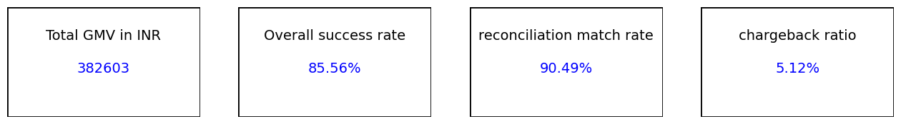
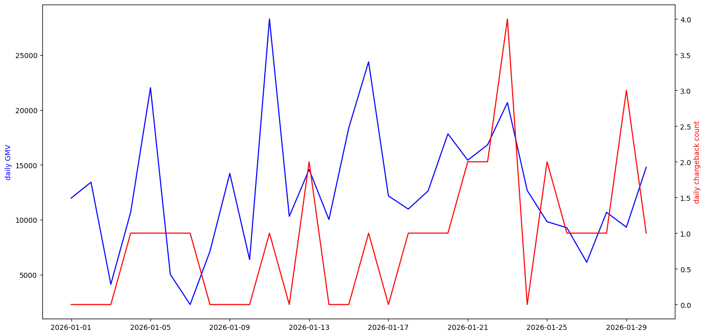
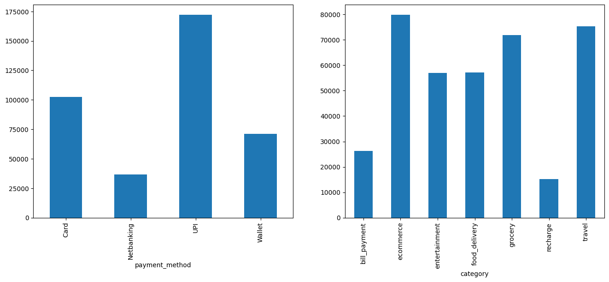
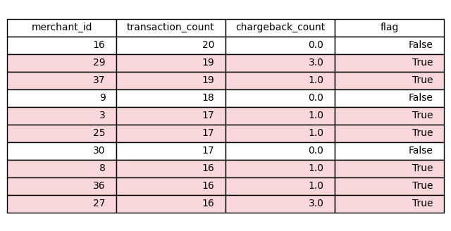

# masai_capstone
Capstone project for Fintech and AI prpogram.
This Read me file provides details for payment_fraud_analytics modeule.

# how to set up the project
0) After going to this folder using "cd payments_fraud_analytics" execute the command "python generate_data.py" to create the data in the files
1) excel workbook "merchant_workbook.xlsx" available with the implementation requested. Also contains the formulae.
2) SQL queries available in the file sql_queries.sql file. Also contains the output
3) Python notebook for reconciliation available as "reconcile.ipynb". Excute this notebook to get the required output 
for discrepancies requested.
4) Dashboard creation login available in the file "dashboard.ipynb". Execute this file to get the dashboard charts.
These charts have been also copied to this READ me file

# how to run it end to end
1) Go to this folder using "cd payments_fraud_analytics". Then execute the command "python generate_data.py" to create the data in the 4 files merchants.csv, users.csv, ledger and gateway_export.csv.
2) Excel workbook available in the file  "merchant_workbook.xlsx". It contains result of all the tasks that were requested.
3) To excute the sql queries
    a) Install sqlite client
    b) Go the payments_fraud_analyiics folder (as was done in Step 1 above)
    c) Run the command sqlite3 paytm_payments.db. This will open a SQL terminal
    d) Execute the queries avaialnle in the file "sql_queries.sql"
4) To run the python notebook that conatains reconciliation logic inside the function reconcile_payments():
    a) Install ipython
    b) Go the folder payment_fraud_analytics as was done in step 1 above
    c) execute the command ipython -c "run reconcile.ipynb"
5) To create the dashboard c=and the charts after installing ipython execute the command in the folder payment_fraud_analytics: ipython -c "run dashboard.ipynb"

# summary of design decisions

Presented below are:
1) excel formulae and their design/explanation
2) SQL queries and their design are available in the sql_queries.sql file
3) Design/explanation of python notebook for payment reconciliation
4) Design of python notebook to create the beloew mentioned charts and the actual chart images
    a) Headline scorecards 
    b) Time series chart for trends
    c) Bar charts for GMV breakdown
    d) Details tabke with conditional formatting

## Part A — Excel/Sheets merchant workbook
Workbook available at merchant_workbook.xlsx

#### VLookup for merchant_name, category, and region from the merchants sheet in transactions-view tab of merchant_workbook.xlsx
Added merchants tab to merchant_workbook.xlsx sheet. Below Vlookup formulae used:

=IFERROR(IFNA(vlookup(C2,merchants!$A$1:$D$41,2,FALSE),"Merchant not found"), "Merchant not found")

=IFERROR(IFNA(vlookup(C2,merchants!$A$1:$D$41,3,FALSE),"Merchant not found"), "Merchant not found")

=IFERROR(IFNA(vlookup(C2,merchants!$A$1:$D$41,4,FALSE),"Merchant not found"), "Merchant not found")

#### HLOOKUP demonstration on a small horizontally-laid-out reference table

Added below reference data in payments_method tab of merchant_workbook.xlsx sheet. 

Data used:
| payment_method  | Wallet | UPI | Card  |
| --------------- | ------ | --- | ----- |
| fees            | 0.25%  | 0%  | 0.50% |

Hlookup formulae used:

=IFERROR(IFNA(hlookup(G2,payment_methods!$A$1:$E$2,2,FALSE),"Payment method not found"), "Payment method not found")

####  Nested IF/AND classification column labeling each transaction "High-Value Merchant Day" when a merchant's daily transaction total (via a pivot table) exceeds INR 5,000 and its region is not "East"

Added 3 new columns
1) transaction_date: Converted ttransaction_time to Date
Formula used: =int(D2)
2) daily_amount_total: Total of amount_inr for a merchant on a day. 
Formula used: =SUMIFS(F:F,C:C,C2,E:E,E2)
3) highvalue_merchant_day: Checks daily_amount_total > 5000 and region not east. It adds text as "Normal" if condition not met or High-Value Merchant Day if condition met. 
Formula used: =IF(AND(N2 > 5000, L2 <> "East"), "High-Value Merchant Day", "Normal")

####  Pivot table summarizing total amount_inr and count of transactions by merchant_id and status, 
1) Added a pivot table with rows: merchant_id and status
2) Added Values: sum(amount_inr) and count(transaction_id)

#### Pivot table to show count-vs-count-unique comparison (unique days transacted vs. total transaction count)
1) Added a pivot table with rows: merchant_id
2) Added Values: Count Unique of transaction_date and count of transaction_id

## PART B - SQL Queries for PART 1 
Created tables and improted data from csv files into the tables. sqlite3 database file available in paytm_payments.db file.

The 6 SQL queries are available in the file sql_queries.csv. Output of the queries are also shared i the file under comments.

### Part C — Python payment reconciliation

Code available in reconcile.ipynb file. File has comments for the design decisions and explanations

### Part D — Four-layer analytics dashboard
All logic available in dashboard.ipynb file.

Output frm the file:
missing_in_gateway_count:  27 (~ 5%)
missing_in_ledger_count:  10 (~ 2%)
amount_mismatch_count:  16 (~ 3%)
amount_mismatch_total:  1250 
status_mismatch_count:  9 (~ 2%)

#### Chart for Score cards
Created 2 functions create_scorecard and create_header_plot. 

1) Used the ledger_df from ledger.csv and used ledger_df['amount_inr'].sum() to get Total GMV scorecard

2) Used len(ledger_df[ledger_df['status'] == 'captured']) / len(ledger_df) * 100 to calculate overall success rate

3) For reconciliation rate, fetched the common ids, merged them into comparison_df and then compared amount_inr  and status. If they are same added it to common_df. Then reconciliation rate was calculated as reconciliation_match_rate = len(common_df) / len(ledger_df) * 100

4) chargeback ratio was calculated as len(ledger_df[ledger_df['status'] == 'chargeback']) / len(ledger_df) * 100

#### Time series chart of daily GMV and daily chargeback count over the 30-day window

Used the below code to get data for time series:

ledger_df['transaction_date'] = pd.to_datetime(ledger_df['transaction_time']).dt.date

ledger_chart_gmv_df = ledger_df.groupby('transaction_date')['amount_inr'].sum()

ledger_chart_chargeback_df = ledger_df[ledger_df['status'] == 'chargeback'].groupby('transaction_date')['amount_inr'].count()

ledger_chart_df = pd.merge(ledger_chart_gmv_df, ledger_chart_chargeback_df, on = 'transaction_date',
                           how="outer", suffixes=("_gmv", "_chargeback_count")).fillna(0)

ledger_chart_df['amount_inr_chargeback_count'] = ledger_chart_df['amount_inr_chargeback_count'].astype(int)

#### Bar Charts of GMV by payment_method and by category (joined from merchants).

Got the data for the bar chart using the below code
payment_method_agg_df = ledger_df.groupby('payment_method')['amount_inr'].sum()

ledger_merchant_category_df = pd.merge(ledger_df, merchant_df, on='merchant_id')

merchant_category_agg_df = ledger_merchant_category_df.groupby('category')['amount_inr'].sum()

#### Table of top 10 merchants by transaction count, with conditional highlighting (e.g., a flag column) for any merchant whose chargeback_ratio exceeds 1% : chargeback_ratio (per-merchant) = (count of that merchant's transactions with status == "chargeback") / (count of all of that merchant's transactions).

Used the below code to get the data to plot

top_merchants_df = ledger_df.groupby('merchant_id')['transaction_id'].count().to_frame()

top_merchants_df = top_merchants_df.rename(columns={'transaction_id':'transaction_count'})

merchants_chargeback_df = ledger_df[ledger_df['status'] == 'chargeback'].groupby('merchant_id')['transaction_id'].count().to_frame().rename(columns={'transaction_id':'chargeback_count'})

top_merchants_flag_df  = pd.merge(top_merchants_df, merchants_chargeback_df, on='merchant_id', how='left')

top_merchants_flag_df['chargeback_count'] = top_merchants_flag_df['chargeback_count'].fillna(0)

top_merchants_flag_df['flag'] = top_merchants_flag_df['chargeback_count'] / top_merchants_flag_df['transaction_count'] * 100 > 1

top_merchants_flag_df = top_merchants_flag_df.sort_values(by='transaction_count', ascending=False)

Then used code to conditionally format the table based the 'flag' value. 

